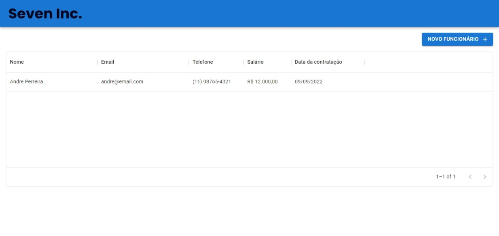
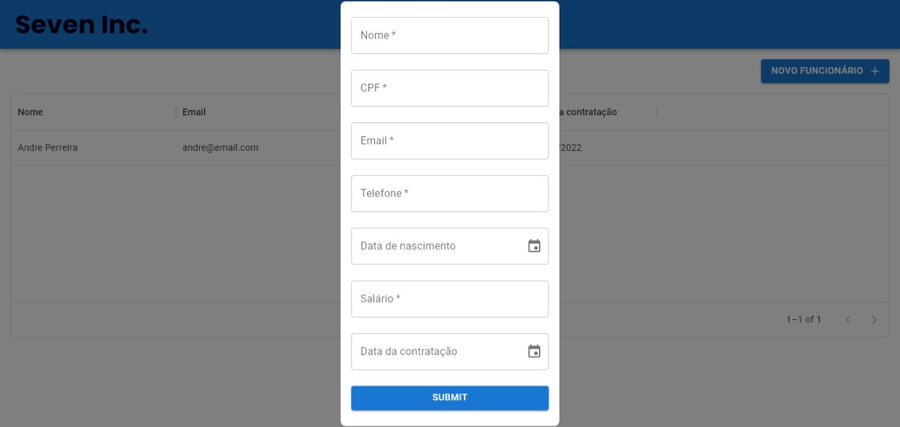
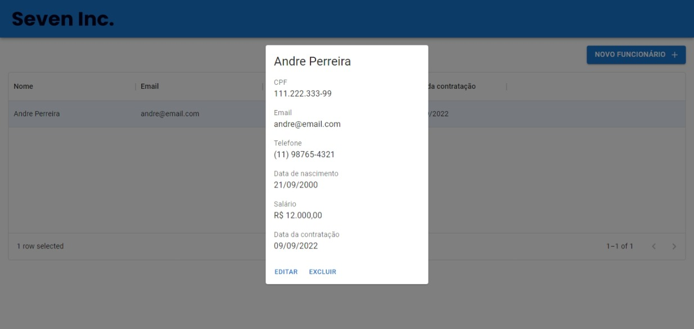

# Seven Inc

<b>Sistema de gestão empresarial</b>.

## Fluxo de utilização

### Home page



Funcionalidades:

- Visualizar funcionários cadastrados.
- Adicionar novos funcionários.
- Abrir detalhes do funcionário ao clicar.

### Cadastrar novos funcionários



Ao clicar em novo funcionário irar abrir um modal para a incersão de dados. Estão implementadas validações simples mas organizadas de forma que permita validações mais robustas. Ao clicar em cadastrar todos os campos serão validados, se não hover erros de validação o modal será fechado, e o novo funcionário será exibido na tabela.

### Detalhes do funcionário



Ao clicar no funcionário será aberto um modal com todas as informações referente ao funcionário selecionado. A partir deste modal é possivel editar os dados do funcionário ou excluir-lo

## Executando a aplicação localmente

- Faça um clone da aplicação

HTTPS:

```
  <https://github.com/PHnrq/seven-inc.git>

```

SSH:

```
git@github.com:PHnrq/seven-inc.git

```

- Instale as dependências

```
npm install

```

- Instale o JSON Server

```
npm install -g json-server

```

- Execute o JSON Server

```
npm run server

```

- Execute a aplicação

```
npm start

```

Agora é só aproveitar.
